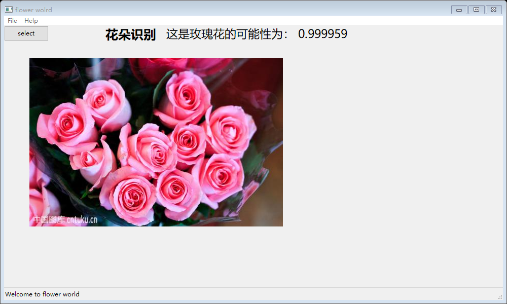

# four-flower


这是一个图像识别项目，基于 tensorflow，现有的 CNN 网络可以识别四种花的种类。适合新手对使用 tensorflow 进行一个完整的图像识别过程有一个大致轮廓。项目包括对数据集的处理，从硬盘读取数据，CNN 网络的定义，训练过程，还实现了一个 GUI 界面用于使用训练好的网络。

## Require

1. 安装 Anaconda
2. 导入环境 environment.yaml  
   `conda env update -f=environment.yaml`

## Quick start

- git clone 这个项目
- 解压 input_data.rar 到你喜欢的目录。
- 修改 train.py 中

```
train_dir = 'D:/ML/flower/input_data'  # 训练样本的读入路径
logs_train_dir = 'D:/ML/flower/save'  # logs存储路径
```

为你本机的目录。

- 运行 train.py 开始训练。
- 训练完成后，修改 test.py 中的`logs_train_dir = 'D:/ML/flower/save/'`为你的目录。
- 运行 test.py 或者 gui.py 查看结果。
